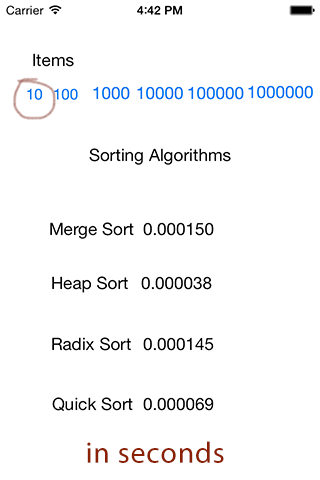
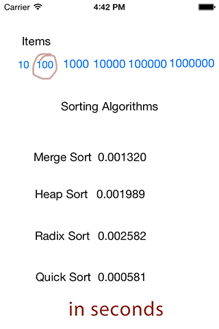
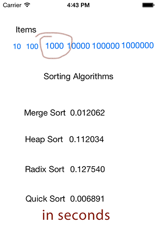
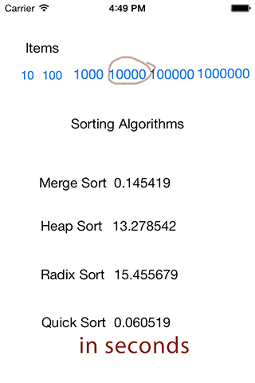

This Project contains Objective-C implementations of the following:

sorting algorithms:
============

- Quick Sort
- Heap Sort
- Radix Sort
- Merge Sort

Data Structures:
==========

- Linked Lists
- Binary Trees
- Hash Table

